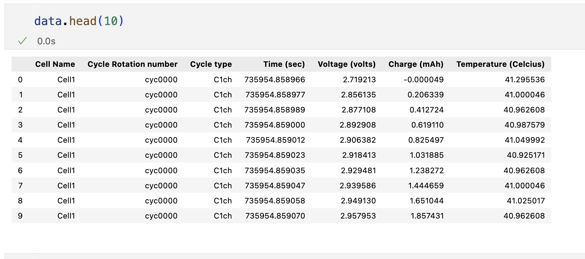
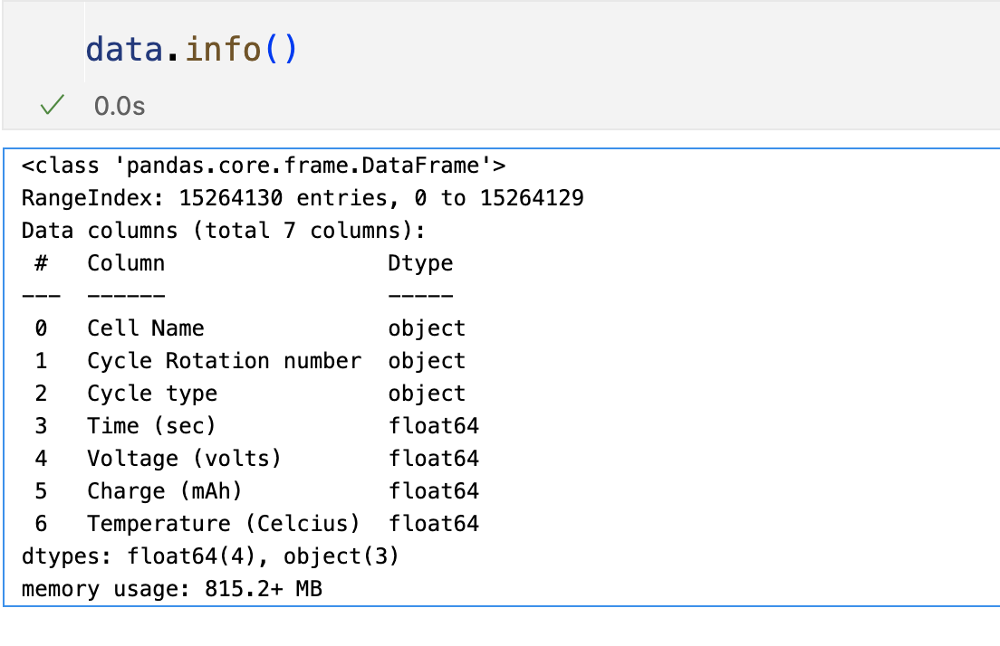
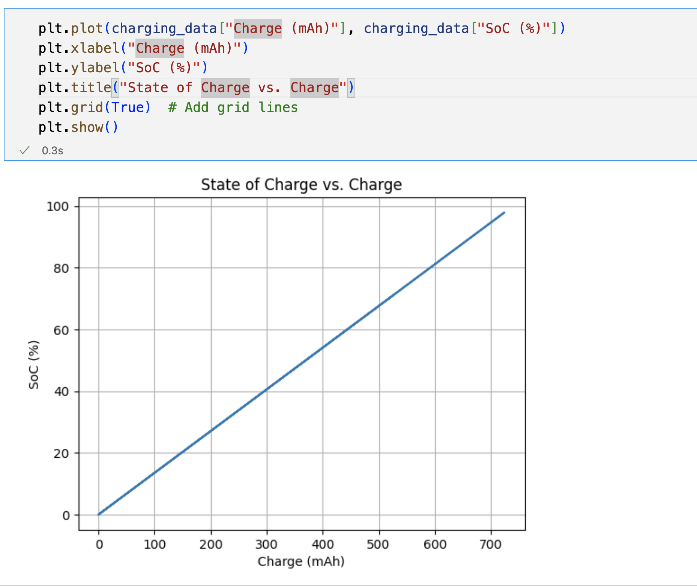
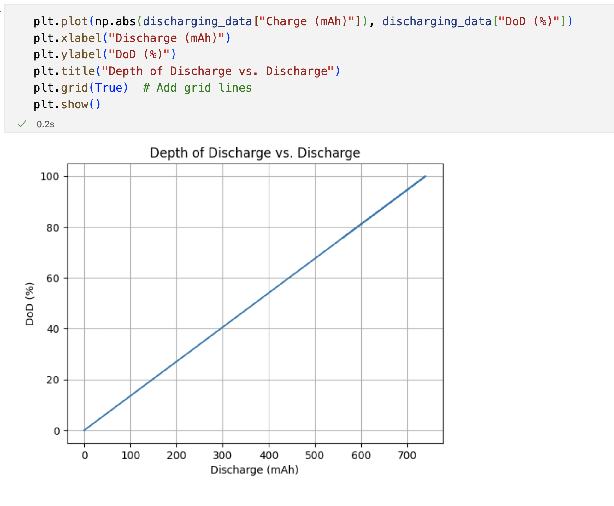
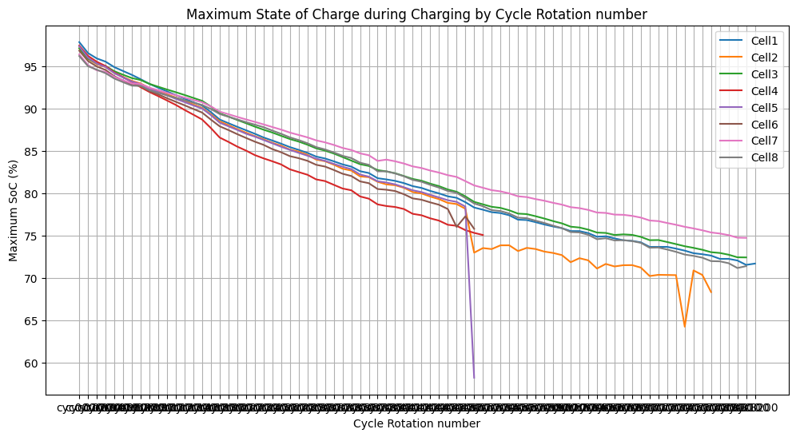
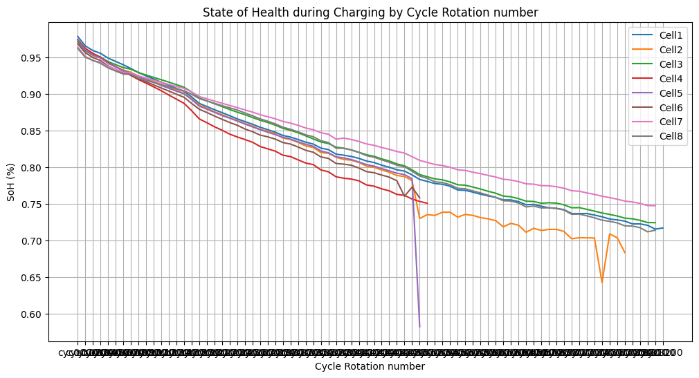

<!-- # Create virtual environment
```bash
conda create -n volinergy_proj_env python=3.9 -y
```

# Activate virtual environment
```bash
conda activate volinergy_proj_env                                                                                                              
``` -->

### Data comes from the following sources:
https://scholar.google.co.uk/citations?hl=en&user=AZdBXIkAAAAJ&view_op=list_works&sortby=pubdate

Oxford_Battery_Degradation_Dataset_1.mat
https://ora.ox.ac.uk/objects/uuid:03ba4b01-cfed-46d3-9b1a-7d4a7bdf6fac


1. Load the data from the .mat file
    - Explore the data in `MatLab` to understand the structure
2. Convert the data to a `.csv` file
    - Load the data in Python using `scipy.io` library
    - Explore the data in Python to understand the structure
    - Convert each layer of the `.mat` dataset into a `pandas dataFrame`
    - Save the `dataframe` to a `.csv` file
    To convert the .mat file to a .csv file, run the following code:
    ```bash
    python main.py
    ```
    main.py contains the following code:
    ```python
        def run_data_conversion():
            # Class instance
            data_file_converter = matToDataframe.DataFileConverter(MAT_FILE_PATH)
            logging.info(
                "Going to load mat file by calling load_mat_file function from DataFileConverter class"
            )
            
            # Load the .mat file
            mat_data = data_file_converter.load_mat_file()
            logging.info("Loaded mat file")
            print("Loaded mat file")
            
            # Get the cell names
            cell_names = data_file_converter.find_cell_names(mat_data)

            logging.info(f"Found cell names: {cell_names}")

            # Convert the .mat file to a dataframe
            battery_data_df = data_file_converter.convert_to_dataframe(mat_data, cell_names)

            # Save the dataframe to a .csv file
            battery_data_df.to_csv(CSV_FILE_PATH, index=False)
            logging.info("Data saved to CSV file")

        if __name__ == "__main__":
            
            # Conver the .mat file to .csv file
            run_data_conversion()
            
            # test if the csv file is created by loading it and printing the first 10 rows
            dataPreparation.test_dataPreparation(CSV_FILE_PATH)
            logging.info("Data Preparation Done")
    ```
    
    You will notice a line in main `data_file_converter = matToDataframe.DataFileConverter(MAT_FILE_PATH)`
    
    I created a class called `DataFileConverter` in the `matToDataframe.py` file. This class contains the following functions:
    - `load_mat_file()`: Load the .mat file
    - `find_cell_names(mat_data)`: Find the cell names in the .mat file
    - `convert_to_dataframe(mat_data, cell_names)`: Convert the `.mat` file to a `dataframe`

3. Load the data from the .csv file into Notebook called `EDA.ipynb` and perform exploratory data analysis on it:

    A transformed data in dataframe looks like this:
    

    - Now we can see the data in tabular form and can perform some exploratory data analysis on it.

    - Information about the data:
    

    - It has three string columns and four float columns.

    - There are no missing values in the data.

    - The data has 15,264,130 rows and 7 columns.

    - Performed feature engineering and added two additional columns: SoC and DoD
        - **State of Charge (SoC):** SoC refers to the current level of charge in a battery relative to its maximum capacity. Analyzing SoC involves understanding how much charge is stored in the battery at any given time, which is essential for predicting battery runtime and estimating remaining charge.
            - Formula to calculate SoC: SoC = (Current Charge / Maximum Charge Capacity) * 100

        - **State of Health (SoH):** SoH represents the overall condition and performance of a battery relative to its original state when new. It reflects factors such as capacity degradation, internal resistance changes, and aging effects. Analyzing SoH helps assess the health and remaining lifespan of the batteries in the dataset.
            - Formula to calculate SoH: SoH = (Current Capacity / Initial Capacity) * 100

        - **Depth of Discharge (DoD):** DoD refers to the percentage of the battery's capacity that has been discharged relative to its maximum capacity. It indicates how deeply the battery has been discharged during its usage. Analyzing DoD can provide insights into usage patterns, battery wear, and degradation over time.
            - Formula to calculate DoD: DoD = 100 - SoC

    - SoC vs Charges:
    
    You can see that the SoC is increasing with the charge cycles. They are positively correlated.

    - DoD vs Discharges:
    
    You can see that the DoD is increasing with the discharge cycles. They are positively correlated.

    **It is important to note that the SoC and DoD are inversely related. As the SoC increases, the DoD decreases, and vice versa.**

    - SoC per Time:
    

    - DoD per Time:
    

    Notice, SoC and DoD decreases with time

    - My best guess is that Charge capacity is decreasing with time. This is why SoC is decreasing with time, same with DoD.

    Charger Capacity vc Initial Capacity:
    

    It is quite evident with this graph that most of the cells decrease in charge capacity with time.

    When we calculate SoH, graph will look similar to this "Maximum SoC vs Cycle Rotation Number" graph.

    

    It is happening because SoH is calculated as the ratio of Current Capacity to Initial Capacity.

        - Remember: SoH = (Current Capacity / Initial Capacity) * 100

        - Initial Capacity was 100% for all cells.

        - So, Initial Capacity number cancels out with 100.

        - So, SoH = Current Capacity (Which is same as Maximum SoC)


# How can we predict when the battery cells will reach the end of their useful life?

**We can use `supervised machine Learning` algorithms like linear regression to predict when the battery cells will reach the end of their useful life.**

- We can use the provided data to train a machine learning model to predict the State of Health (SoH) of the battery cells. When the SoH of a battery cell drops below a certain threshold, it indicates that the battery cell is reaching the end of its useful life.

- We can use the SoH predictions to estimate the remaining lifespan of the battery cells and plan for their replacement or maintenance accordingly.


